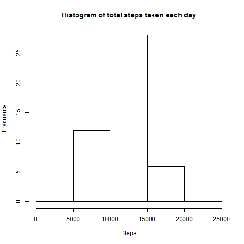
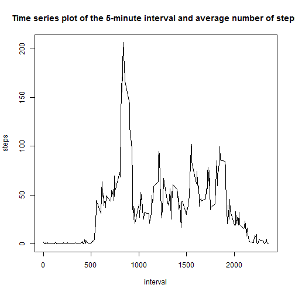
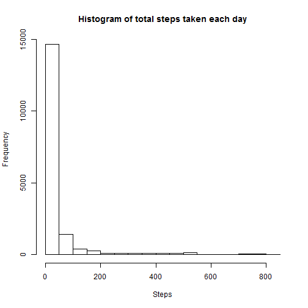
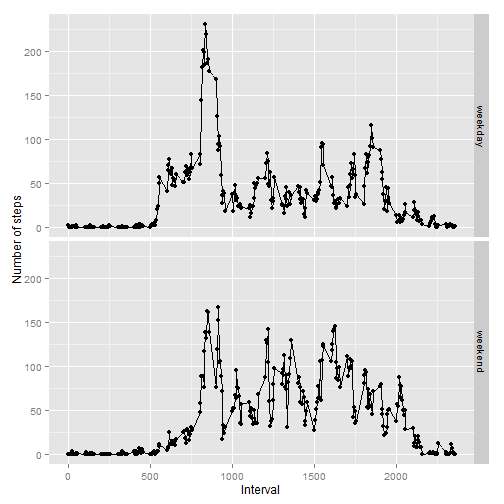

**title: "PA1_template"**


Loading and preprocessing the data


```r
download.file("https://d396qusza40orc.cloudfront.net/repdata%2Fdata%2Factivity.zip", destfile = "activity.zip")
unzip("activity.zip")
```


```r
activity <- read.csv("activity.csv", header = TRUE, sep=",")
```

Total Number of Steps taken per day

Remove the NAs in the activity dataframe

```r
activity_NA_Removed <- activity[complete.cases(activity),]

total_steps_per_day <- aggregate(steps~date, data=activity_NA_Removed, FUN=sum)
```

Histogram of total number of steps taken per day


```r
hist(total_steps_per_day$steps, xlab="Steps", ylab="Frequency", main= "Histogram of total steps taken each day")
```

 

Mean of steps taken per day


```r
meansteps <- mean(activity_NA_Removed$steps)
meansteps
```

```
## [1] 37.3826
```

Median of steps taken per day


```r
mediansteps <- median(activity_NA_Removed$steps)
mediansteps
```

```
## [1] 0
```

Average number of steps taken, averaged across all days


```r
average_number_of_steps <- aggregate(steps~interval, data=activity_NA_Removed, FUN = mean)
```

Time series plot of the average steps taken averaged across all days


```r
plot(average_number_of_steps$interval, average_number_of_steps$steps, type = "l", xlab = "interval", ylab = "steps", main = "Time series plot of the 5-minute interval and average number of steps")
```

 

The 5-minute interval that has the maximum number of steps


```r
interval_max_steps <- subset(average_number_of_steps, steps==max(steps), select = interval)
interval_max_steps
```

```
##     interval
## 104      835
```

Total number of missing values


```r
missing_values <- sum(is.na(activity))
missing_values
```

```
## [1] 2304
```

**Strategy for imputing missing values:** The strategy to imput NA values is to fill the missing values with the average steps for that interval.

Imputing values to the missing values in the dataset with the above strategy


```r
imputed_activity <- as.data.frame(activity)
imputed_activity$steps <- replace(imputed_activity$steps, is.na(imputed_activity$steps), average_number_of_steps$steps)
```

Histogram of the total number of steps taken with the new dataset created by imputting values


```r
hist(imputed_activity$steps, xlab="Steps", ylab="Frequency", main= "Histogram of total steps taken each day")
```

 

Mean of the total number of steps taken after imputting values


```r
imputed_meansteps <- mean(imputed_activity$steps)
imputed_meansteps
```

```
## [1] 37.3826
```

Median of the total number of steps taken after imputting values


```r
imputed_mediansteps <- median(imputed_activity$steps)
imputed_mediansteps
```

```
## [1] 0
```

After imputting the values, the mean and median still remains the same.

Calculate the day of the week and mark it as a weekday or a weekend day


```r
imputed_activity$wkday_wkend <- weekdays(as.Date(imputed_activity$date))
imputed_activity[imputed_activity=="Saturday"] = "weekend"
imputed_activity[imputed_activity=="Sunday"] = "weekend"
imputed_activity[imputed_activity=="Monday"] = "weekday"
imputed_activity[imputed_activity=="Tuesday"] = "weekday"
imputed_activity[imputed_activity=="Wednesday"] = "weekday"
imputed_activity[imputed_activity=="Thursday"] = "weekday"
imputed_activity[imputed_activity=="Friday"] = "weekday"
```

Create a dataset with the average steps being calculated after the missing values imputed and weekend or weekday being marked


```r
average_steps_interval_imputed <- aggregate(steps~interval + wkday_wkend, data= imputed_activity, FUN=mean)
```

Time series plot for the five minute interval and the average number of steps taken average across all weekend and weekday days


```r
library(ggplot2)
g<- qplot(average_steps_interval_imputed$interval, average_steps_interval_imputed$steps, data = average_steps_interval_imputed, facets = wkday_wkend~.)
g<- g + geom_line()
g <- g+ labs(x= "Interval") + labs(y="Number of steps")
g
```

 
